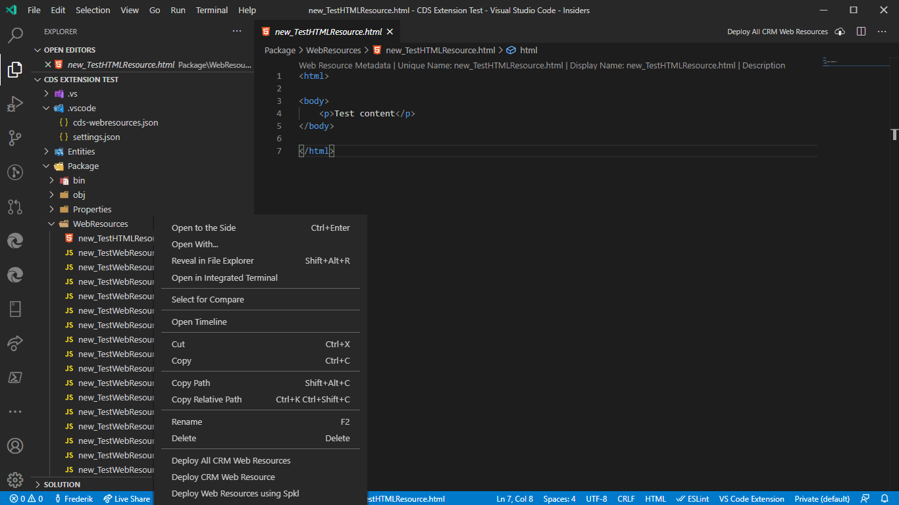
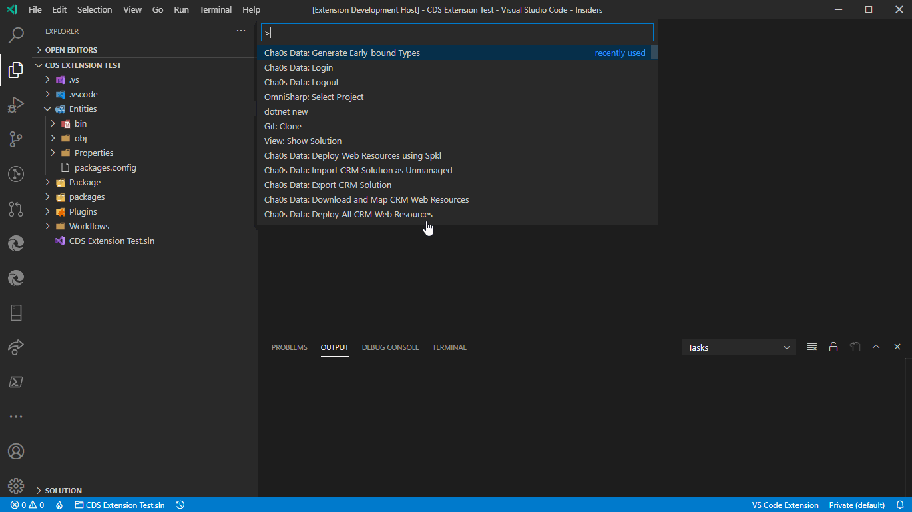
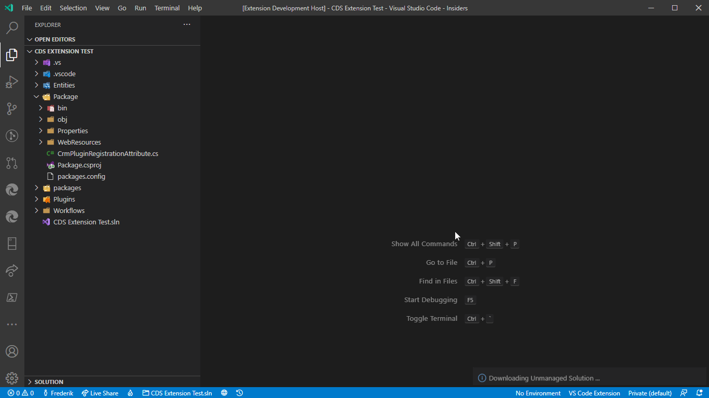
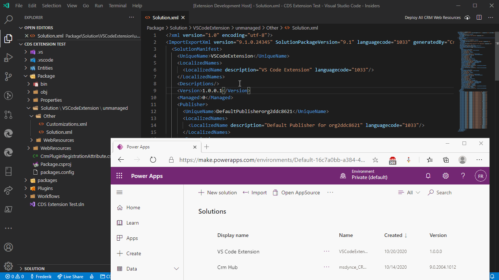
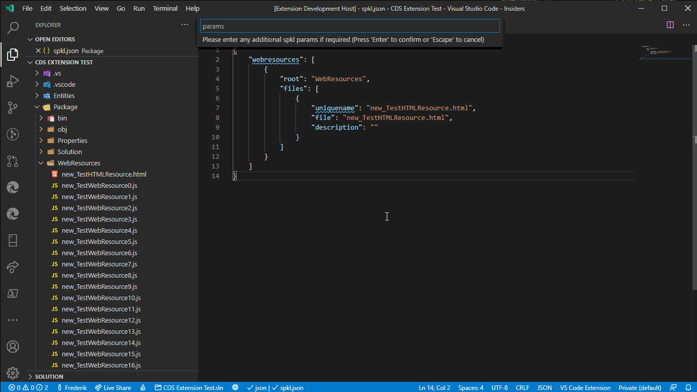

# Cha0s Data Tools (Dynamics 365)

An extension to assist when working with Dynamics 365 (CRM) and Common Data Services customizations. The idea was to make uploading and publishing web resources easier, and eventually manage the entire dev process.

#### This extension is currently in beta, more features are being added and with it more bugs

Early-bound classes are generated using the [DLaB.Xrm.EarlyBoundGenerator](https://github.com/daryllabar/DLaB.Xrm.XrmToolBoxTools/wiki/Early-Bound-Generator). 
Support for [Spkl](https://github.com/scottdurow/SparkleXrm/wiki/spkl) has been included, this is currently the only way to do plugin deployments with this extension.

Currently not supported but planned for future:
* Generate Early-bounds for javascript & typescript

### Licence

The source code to this extension is available on https://github.com/Cha0s2nd/cha0s2nd-vscode-cds and licensed under the [MIT licence](https://cha0s2nd.neocities.org/vscode/extensions/cds/license.html).

## Features

Deploy web resources in bulk or individually.

Generate Early-bound Entities

Export/Extract Solutions

Import Solutions

Spkl commands

## Requirements

The [dotnet-cli](https://dotnet.microsoft.com/download/) is required for the dependencies to install and [.Net 4.6.2](https://dotnet.microsoft.com/download/) is required for Dynamics development.
If you wish to use [Spkl](https://www.nuget.org/packages/spkl/) please install the required NuGet packages in the projects.

## Getting Started

Please refer to the [getting started wiki page](https://github.com/Cha0s2nd/cha0s2nd-vscode-cds/wiki/Getting-Started) for more detail.

The following 3 simple steps should get you running:
1. Create a base C# class library project.
2. Customize the local file locations.
3. Download and map web resources.

## Extension Settings

* `cha0s2nd-vscode-cds.auth.useLegacy`: Use legacy login for On-Prem CRM connections).
* `cha0s2nd-vscode-cds.spkl.settings`: The path to the spkl.json file to use (leave blank to use workspace settings).
* `cha0s2nd-vscode-cds.solution.folder`: The folder to extract the Solution to and package the Solution from.
* `cha0s2nd-vscode-cds.solution.versionIncrement`: Increment the solution version when importing.
* `cha0s2nd-vscode-cds.solution.zipFile`: The temp file to create for the exported and packaged solution.
* `cha0s2nd-vscode-cds.solution.exportType`: The type of solution to Export (managed, unmanaged, both).
* `cha0s2nd-vscode-cds.solution.importType`: The type of solution to Import (managed, unmanaged).
* `cha0s2nd-vscode-cds.webresource.folders`: The root folders to the Web Resources.
* `cha0s2nd-vscode-cds.webresource.deleteAction`: Select whether or not Web Resources in the Solution no longer present in folder tree should be Deleted or Removed from the solution.
* `cha0s2nd-vscode-cds.webresource.processAll`: Process all Web Resource files in the root folders (deselect to specify a list).
* `cha0s2nd-vscode-cds.plugin.assemblies`: Plugin assemblies to deploy.
* `cha0s2nd-vscode-cds.workflow.assemblies`: Custom Workflow Activity assemblies to deploy.
* `cha0s2nd-vscode-cds.earlybound.actions`: List of Actions to generate.
* `cha0s2nd-vscode-cds.earlybound.entities`: List of Entities to generate.
* `cha0s2nd-vscode-cds.earlybound.optionSetEnums`: Generate Enums for OptionSet values.
* `cha0s2nd-vscode-cds.earlybound.globalOptionSetEnums`: Generate Enums for Global OptionSet values.
* `cha0s2nd-vscode-cds.earlybound.stateEnums`: Generate Enums for States and Statuses values.
* `cha0s2nd-vscode-cds.earlybound.fileName`: Path for the Earlybound output.
* `cha0s2nd-vscode-cds.earlybound.namespace`: The Namespace to use when generating entities.
* `cha0s2nd-vscode-cds.earlybound.serviceContext`: The Name of the service context.
* `cha0s2nd-vscode-cds.earlybound.oneFilePerType`: Generate a file for each entity.
* `cha0s2nd-vscode-cds.earlybound.useDLaBGenerator`: Enable the DLaB.Xrm.EarlyBoundGenerator alternatively to the Spkl built-in generator.
* `cha0s2nd-vscode-cds.earlybound.generatorSettings`: The [DLaB.Xrm.EarlyBoundGenerator](https://github.com/daryllabar/DLaB.Xrm.XrmToolBoxTools/wiki/Early-Bound-Generator) Settings.

## Known Issues

Spkl only updates plugin assemblies with the CrmPluginRegistrationAttribute

## Release Notes

### [0.1.6]
Added
- Added Web Resources to Treeview
- Added Security Roles to Treeview
Changed
- Login aggressiveness reduced
- Added ability to manually enter auth codes

Please refer to [CHANGELOG.md](https://github.com/Cha0s2nd/cha0s2nd-vscode-cds/blob/master/CHANGELOG.md) for more detail.

-----------------------------------------------------------------------------------------------------------